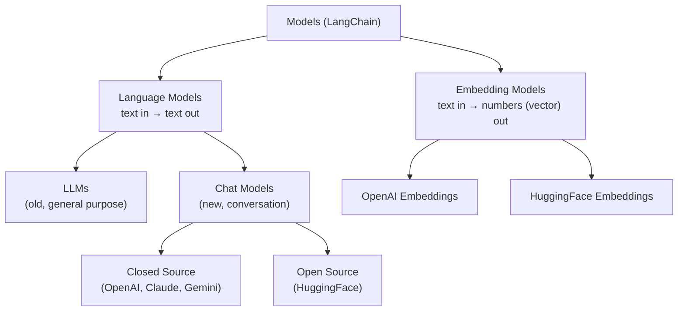
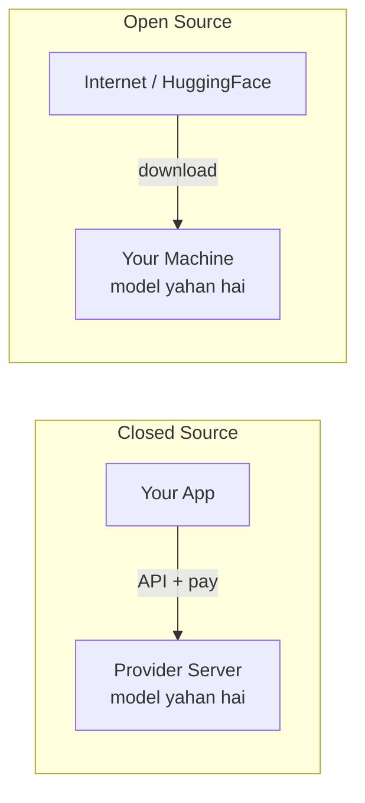
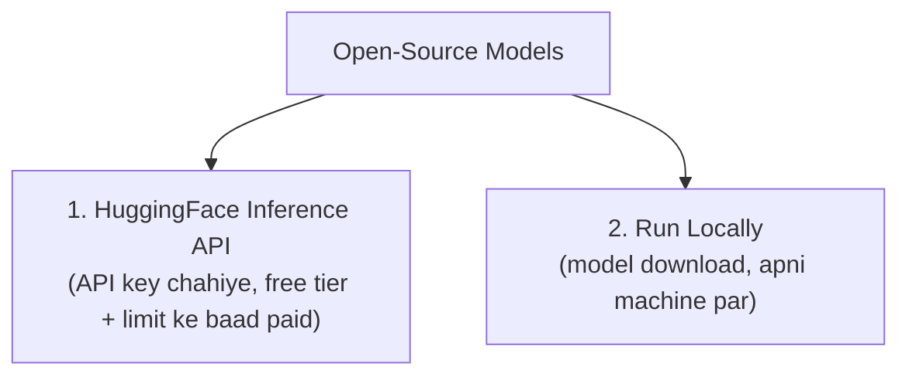
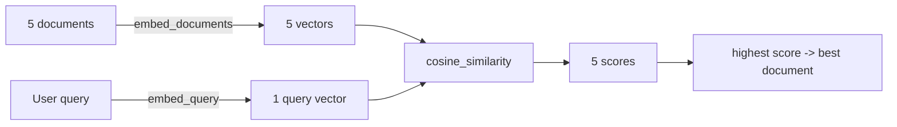

# 03 — LangChain Models: Language Models, Chat Models & Embedding Models

> **Video:** [LangChain Playlist — Video 3 (Models)](https://www.youtube.com/watch?v=HdcLE8JuMrA&list=PLKnIA16_RmvaTbihpo4MtzVm4XOQa0ER0&index=5)
> **Speaker:** Nitish (CampusX)
> **Sources used:** auto-generated YouTube transcript (main) + author ke playlist notes (Models section, pages 22–32) + current docs check (Oct 2026)
> **Language:** Hinglish (Roman script), technical terms English mein

**Legend (notes mein ye blocks milenge):**

| Block | Matlab |
|---|---|
| `Extra` | Speaker ne jo important cheez miss ki, wo yahan add hai |
| `⚠️ Correction` | Speaker ne jo galat/imprecise bola, uska sahi version |
| `🔄 Update` | Playlist purani hai (early 2025), to ab jo badal gaya uska latest version |

---

## Table of Contents

1. [Recap + Models component kya hai?](#1-recap--models-component-kya-hai)
2. [Plan of Action](#2-plan-of-action)
3. [Language Models: LLMs vs Chat Models](#3-language-models-llms-vs-chat-models)
4. [Project Setup](#4-project-setup)
5. [Demo 1: LLM (OpenAI)](#5-demo-1-llm-openai)
6. [Demo 2: Chat Models (OpenAI, Anthropic, Google)](#6-demo-2-chat-models-openai-anthropic-google)
7. [Important Parameters: temperature & max tokens](#7-important-parameters-temperature--max-tokens)
8. [Open Source Models: theory](#8-open-source-models-theory)
9. [Demo 3: Open Source via HuggingFace Inference API](#9-demo-3-open-source-via-huggingface-inference-api)
10. [Demo 4: Open Source Locally (HuggingFace Pipeline)](#10-demo-4-open-source-locally-huggingface-pipeline)
11. [Embedding Models](#11-embedding-models)
12. [Mini Project: Document Similarity App](#12-mini-project-document-similarity-app)
13. [Key Takeaways](#13-key-takeaways)
14. [Self-Test Questions](#14-self-test-questions)

---

## 1. Recap + Models component kya hai?

**Ab tak (Video 1 & 2):**

| Video | Topic |
|---|---|
| 1 | LangChain kya hai, kyun chahiye, kaun si applications ban sakti hain, alternatives |
| 2 | LangChain ke Components: Models, Prompts, Chains, Indexes, Memory, Agents |

**Aaj ka video:** sirf **Models component**, poora in-depth + coding.

### Models component = ek common interface

- Duniya mein bahut saare AI models hain (OpenAI, Anthropic, Google, open-source...).
- Har company ka API **alag tarike se behave** karta hai → apna code har provider ke liye alag likhna padta.
- LangChain ka Model component ek **uniform interface** deta hai, jisse kisi bhi model se same style mein baat kar sakte ho.

> **Author ke notes (definition):** Model Component abstracts the complexity of working directly with different LLMs, chat models and embedding models. Isse AI-generated text, similarity search ke liye embeddings, aur RAG apps banana easy ho jata hai.

### Do tarah ke models



| | Language Models | Embedding Models |
|---|---|---|
| Input | Text | Text |
| Output | **Text** | **Series of numbers (vector / embedding)** |
| Use | Chatbot jaisi applications | **Semantic search** → RAG apps |
| Example | "Capital of India?" → "New Delhi" | "Capital of India?" → `[0.12, -0.55, ...]` |

> **Extra:** Embedding = text ka *contextual meaning* represent karne wala vector. Same meaning wale texts ke vectors paas-paas hote hain, isiliye similarity search possible hai.

---

## 2. Plan of Action

Video 100% coding-based hai:

| Part | Kya karenge |
|---|---|
| **Part 1: Language Models** | LLM (OpenAI) → Chat Models: **closed source** (OpenAI GPT, Anthropic Claude, Google Gemini) → **open source** (HuggingFace: API + local) |
| **Part 2: Embedding Models** | **Closed source** (OpenAI embeddings) → **Open source** (HuggingFace, local) |
| **Mini project** | Document Similarity app (kaunsa document query se sabse zyada similar hai) |

> **Extra:** Speaker ne chatbot app banane ka plan hataya, kyunki uske liye pehle **Prompts** padhna better hai → next video.

---

## 3. Language Models: LLMs vs Chat Models

**Language Models** = AI models jo text input lete hain, process karte hain, aur text output dete hain. Inke 2 types hain: **LLMs** aur **Chat Models**.

### 3.1 LLMs (base models)

- **General-purpose** models: text generation, summarization, translation, code generation, Q&A, kuch bhi.
- **Input: plain string → Output: plain string.**
- Purane models hain. LangChain mein inka **support dheere-dheere khatam** ho raha hai; naye projects mein use karne ko **recommended nahi**.

### 3.2 Chat Models (instruction-tuned)

- **Conversation tasks** ke liye specialized.
- **Input: sequence of messages → Output: chat messages.**
- Pehle se **fine-tuned on chat datasets** (multi-user conversations).
- Chatbots, agents, coding assistants, customer support, AI tutors, sab inse bante hain.

### 3.3 Comparison table

| Feature | LLMs (Base Models) | Chat Models (Instruction-Tuned) |
|---|---|---|
| **Purpose** | Free-form text generation | Optimized for multi-turn conversations |
| **Training data** | General text corpora (books, articles, Wikipedia) | General corpora **+ fine-tuned on chat datasets** (dialogues, user-assistant) |
| **Memory & Context** | No built-in memory (pichli baat yaad nahi) | Structured **conversation history** support |
| **Role awareness** | No `system` / `user` / `assistant` roles | Roles samajhte hain |
| **Example models** | GPT-3, Llama-2-7B, Mistral-7B, OPT-1.3B | GPT-4, GPT-3.5-turbo, Llama-2-Chat, Mistral-Instruct, Claude |
| **Use cases** | Text generation, summarization, translation, creative writing, code generation | Conversational AI, chatbots, virtual assistants, customer support, AI tutors |

### 3.4 Role awareness kya hai?

Chat model ko tum ek **role** de sakte ho, e.g. *"You are a highly qualified doctor. Tell me about this disease."* Ye ek **system-level message** hai. Model ko pata hota hai ki **kaun system hai, kaun user, kaun AI**.

### 3.5 Technical difference (LangChain ke andar)

| Class | Inherits from |
|---|---|
| `OpenAI` (LLM) | `BaseOpenAI` → `BaseLLM` |
| `ChatOpenAI` (Chat Model) | `BaseChatOpenAI` → `BaseChatModel` |

Sab LLMs `BaseLLM` se aur sab chat models `BaseChatModel` se inherit karte hain. (Speaker ne bola: ye thoda technical hai, na pata ho to bhi chalega.)

> **Extra:** Chat models ka input "messages" ka list hota hai, jinke 3 main types hain:
> - `SystemMessage`: AI ko role / instructions dena
> - `HumanMessage`: user ka message
> - `AIMessage`: model ka reply
>
> Ye aage Prompts / Memory ke videos mein detail mein aayega.

> **🔄 Update:** LangChain **v1.x** mein chat models hi default hain. Purani legacy cheezein (old chains, LLM-style APIs) ab **`langchain-classic`** package mein shift ho gayi hain, jo official docs ke hisaab se **December 2026 tak sirf security fixes** ke liye maintain hoga. Naye code mein chat models hi use karo. Saath hi ek unified helper aaya hai:
>
> ```python
> from langchain.chat_models import init_chat_model
>
> model = init_chat_model("openai:gpt-4.1", temperature=0)
> # provider switch karna: sirf string badlo, e.g. "anthropic:<model-id>"
> ```
>
> (Isse model/provider badalna aur easy ho jata hai. Video ke explicit classes `ChatOpenAI`, `ChatAnthropic`, etc. abhi bhi valid hain.)

### 3.5.1 Kab kya use karein?

| Tum kya bana rahe ho | Use karo |
|---|---|
| Text generation, summarizer, translation, code generation | LLM (theoretically) → **practically chat model hi use karo** |
| Chatbot, virtual assistant, customer support bot, AI tutor, agents | **Chat Model** |

---

## 4. Project Setup

### 4.1 Steps

```bash
# 1) Folder banao (e.g. langchain-models) aur VS Code mein open karo

# 2) Virtual environment banao
python -m venv venv

# 3) Activate karo
venv\Scripts\activate          # Windows
# source venv/bin/activate     # Mac / Linux

# 4) requirements.txt banao (libraries ki list) aur install karo
pip install -r requirements.txt

# 5) Test: LangChain install hua ya nahi
python test.py
```

`test.py`:

```python
import langchain
print(langchain.__version__)
```

### 4.2 Libraries jo is video mein use hui

> **Extra:** `requirements.txt` ka exact content transcript mein nahi aaya. Video ke code ke hisaab se in packages ki zarurat padti hai:

| Package | Kaam |
|---|---|
| `langchain` | Core framework |
| `langchain-openai` | OpenAI integration (`OpenAI`, `ChatOpenAI`, `OpenAIEmbeddings`) |
| `langchain-anthropic` | Claude integration (`ChatAnthropic`) |
| `langchain-google-genai` | Gemini integration (`ChatGoogleGenerativeAI`) |
| `langchain-huggingface` | HuggingFace integration (`ChatHuggingFace`, `HuggingFaceEndpoint`, `HuggingFacePipeline`, `HuggingFaceEmbeddings`) |
| `python-dotenv` | `.env` se secret keys load karna |
| `scikit-learn`, `numpy` | Cosine similarity (mini project) |
| `transformers`, `torch`, `sentence-transformers` | Local HuggingFace models chalane ke liye |

### 4.3 Folder structure

```
langchain-models/
├── .env                  # secret API keys (kabhi GitHub pe push mat karo)
├── requirements.txt
├── test.py
├── LLMs/
│   └── llm_demo.py
├── ChatModels/
│   ├── chatmodel_openai.py
│   ├── chatmodel_anthropic.py
│   ├── chatmodel_google.py
│   ├── chatmodel_hf_api.py
│   └── chatmodel_hf_local.py
└── EmbeddedModels/
    ├── embedding_openai_query.py
    ├── embedding_openai_docs.py
    ├── embedding_hf_local.py
    └── document_similarity.py
```

> **Extra:** Ye bhi important: `.gitignore` mein `.env` aur `venv/` add karo. Agar API key galti se GitHub pe chali jaye to us key ko turant **revoke/regenerate** karo.

### 4.4 API keys aur `.env` file

Closed-source models ke liye provider se **API key** leni padti hai aur `.env` mein rakhte hain (code mein direct nahi likhte).

```env
OPENAI_API_KEY="sk-..."
ANTHROPIC_API_KEY="..."
GOOGLE_API_KEY="..."
HUGGINGFACEHUB_API_TOKEN="hf_..."
```

> **Important (speaker ne bola):** Variable ka **naam exactly wahi** rakho jo library expect karti hai. Naam badla to `load_dotenv()` key locate nahi karega aur code fail ho jayega.

| Provider | Key kahan se milegi | Env variable |
|---|---|---|
| OpenAI | `platform.openai.com` → Settings → API keys | `OPENAI_API_KEY` |
| Anthropic | Anthropic Console → Get API keys | `ANTHROPIC_API_KEY` |
| Google (Gemini) | Google AI Studio → Get a Gemini API key | `GOOGLE_API_KEY` |
| HuggingFace | Account → Access Tokens → Create new token (**Read** access) | `HUGGINGFACEHUB_API_TOKEN` |

> **Extra:** Transcript mein Google aur HuggingFace ke variable names garbled aaye hain; upar wale naam LangChain ke standard defaults hain. HuggingFace ke liye `HF_TOKEN` bhi commonly kaam karta hai (`huggingface_hub` ke through).

> **Speaker ka note (pricing):** OpenAI ab free credits nahi deta; API use karne ke liye **minimum credit recharge** chahiye (speaker ne ~$5 recharge kiya, kaafi bataya). Anthropic bhi paid hai. Zyada kharch nahi karna ho to bas video dekho, ya HuggingFace / local wale demos follow karo.
>
> **Speaker ki reason:** Companies mein abhi bhi mostly OpenAI APIs chalti hain, isliye practice ke liye try karna useful hai.

---

## 5. Demo 1: LLM (OpenAI)

**Flow:** libraries import → `load_dotenv()` → `OpenAI(model=...)` object → `.invoke(prompt)` → print result.

```python
from langchain_openai import OpenAI
from dotenv import load_dotenv

load_dotenv()  # .env se OPENAI_API_KEY load hota hai

llm = OpenAI(model="gpt-3.5-turbo-instruct")

result = llm.invoke("What is the capital of India")
print(result)
```

**Output:** `The capital of India is New Delhi.` (plain string)

| Step | Code | Kaam |
|---|---|---|
| 1 | `from langchain_openai import OpenAI` | LangChain ↔ OpenAI integration package se class import |
| 2 | `load_dotenv()` | `.env` file se secrets current environment mein load |
| 3 | `OpenAI(model=...)` | LLM object, batao kaunse model se baat karni hai |
| 4 | `llm.invoke(prompt)` | Prompt model ko bhejta hai, reply laata hai |

> **`invoke()` kyun important hai:** LangChain ke almost saare core components (models, prompts, chains) mein ye method hota hai. Iski backstory **Runnable interface** ke video mein aayegi.

**Observation:** LLM ko **string** bheji, **string** hi wapas mili → ye confirm karta hai ki ye LLM hai.

> **🔄 Update:** `gpt-3.5-turbo-instruct` ek legacy completion-style model hai. Is style ki zarurat ab practically nahi; Chat Model approach (next section) use karo. Latest OpenAI model IDs ke liye OpenAI ka Models page dekho.

---

## 6. Demo 2: Chat Models (OpenAI, Anthropic, Google)

LangChain ka interface **consistent** hai: LLM wale code mein bahut kam changes se chat model ban jata hai.

### 6.1 ChatOpenAI

```python
from langchain_openai import ChatOpenAI
from dotenv import load_dotenv

load_dotenv()

model = ChatOpenAI(model="gpt-4")   # temperature=..., max_completion_tokens=... bhi de sakte ho

result = model.invoke("What is the capital of India")
print(result.content)
```

**Difference from LLM:**

| | LLM (`OpenAI`) | Chat Model (`ChatOpenAI`) |
|---|---|---|
| Variable name (convention) | `llm` | `model` |
| `invoke()` returns | Plain **string** | **AIMessage object** |
| Answer kahan hai | Seedha result | `result.content` |

Agar `print(result)` karo to `content` ke saath **metadata** bhi dikhta hai: prompt tokens, completion tokens, total tokens, model name, finish reason, etc. Sirf answer chahiye to `result.content`.

> **Extra:** `AIMessage` mein common fields: `content` (answer), `response_metadata` (model name, finish reason, token usage), `usage_metadata` (input/output/total tokens), `id`. Token usage se tum cost track kar sakte ho.

> **Extra (models list):** Kaun se OpenAI models available hain, unki **context window** aur **max output tokens** kya hain, ye OpenAI website ke Models section mein milta hai. Decision usi ke basis pe lete hain.

### 6.2 ChatAnthropic (Claude)

Process same hai. **Claude** ko kai jagah GPT ke barabar ya better bataya jata hai, aur company (Anthropic) ke API bhi industry mein use hote hain.

```python
from langchain_anthropic import ChatAnthropic
from dotenv import load_dotenv

load_dotenv()

model = ChatAnthropic(model="<claude-model-id>")  # video mein Claude 3.5 wala model use hua

result = model.invoke("What is the capital of India")
print(result.content)
```

| Step | Kya badla (OpenAI se) |
|---|---|
| Import | `ChatAnthropic` from `langchain_anthropic` |
| Key | `ANTHROPIC_API_KEY` (exact naam) |
| Model | Anthropic docs ke Models page se pick karo |

> **🔄 Update:** Video mein Claude 3.5 generation use hui thi (ab purani). Current naam ke liye Anthropic docs ka model page dekho; e.g. Sonnet-tier ke liye ab `claude-sonnet-5-5` jaise IDs hain:
>
> ```python
> model = ChatAnthropic(model="claude-sonnet-5-5")
> ```

### 6.3 ChatGoogleGenerativeAI (Gemini)

```python
from langchain_google_genai import ChatGoogleGenerativeAI
from dotenv import load_dotenv

load_dotenv()

model = ChatGoogleGenerativeAI(model="gemini-1.5-pro")

result = model.invoke("What is the capital of India")
print(result.content)
```

Key: Google AI Studio se **Gemini API key** → `.env` mein (`GOOGLE_API_KEY`).

> **🔄 Update:** `gemini-1.5-pro` ab **retire** ho chuka hai (Google ke docs ke hisaab se Sept 2025 mein; us ID par call karne par error aata hai). Isko replace karo current Gemini model se, e.g. `gemini-2.5-pro` ya jo latest stable ho. Google ka official model lifecycle page check karo, kyunki 2.5 series ki retirement bhi announce hone ki reports hain.
>
> Saath hi `langchain-google-genai` ka major version bada hai (v4.x), to old code chalate waqt migration notes dekh lo.

### 6.4 Main takeaway (LangChain ki power)

Teeno providers ke liye **almost identical code**:

```python
model = <ProviderChatClass>(model="<model-name>")
result = model.invoke("...")
print(result.content)
```

Bas **class, API key aur model name** badalte hain. Yahi LangChain ka **Model Agnostic** fayda hai.

---

## 7. Important Parameters: `temperature` & max tokens

### 7.1 `temperature`

- Model ke output ki **randomness / creativity** control karta hai.
- **Low** → zyada **deterministic & predictable**.
- **High** → zyada **random, creative, diverse**.

| Use case | Suggested temperature |
|---|---|
| Factual answers: math, code | **0 – 0.3** |
| General Q&A, explanations | **~0.5 – 0.7** |
| Creative: writing, story-telling, jokes | **~0.9 – 1.2** |
| Very random: brainstorming | **1.5+** |

```python
model = ChatOpenAI(model="gpt-4", temperature=1.5)
```

**Speaker ka experiment:**

| Prompt | Temperature | Observation |
|---|---|---|
| "Suggest me 5 Indian male names" | 0 vs 1.8 | Almost koi khaas fark nahi (prompt sahi nahi tha) |
| "Write a 5 line poem on cricket" | 0 vs 1.5 | Poem alag aayi, par speaker khud quality judge nahi kar paaye |

**Rule of thumb:** deterministic tasks (code generation) → **0 ki taraf**; creative tasks (story, poem, jokes) → **zyada** value.

> **⚠️ Correction (author ke notes ka "A mistake from my side!" page):** Author ne apne notes mein temperature ke liye explicitly **`0 → 2`** likha hai. Matlab OpenAI-style temperature range **0 se 2** tak hai (video mein "1.5+" ko extreme maana gaya tha, par range 2 tak jaati hai).
>
> **Extra (provider-wise range, jo speaker ne nahi bataya):** ye provider par depend karta hai. OpenAI aur Gemini mein generally **0–2**, Anthropic (Claude) mein **0–1**. Koi bhi value dene se pehle us provider ke docs dekho.

> **Extra:** `temperature=0` ka matlab "mostly" deterministic hai, 100% guarantee nahi.

> **🔄 Update:** Kuch naye **reasoning models** mein `temperature` customize karne ki permission nahi hoti (fixed default). Agar error aaye to provider docs check karo.

### 7.2 `max_completion_tokens` (output length limit)

- Batata hai ki response mein **maximum kitne tokens** chahiye.
- **Kyun useful:** paid APIs mein **per token** pay karna padta hai, isliye developer output ko restrict kar sakta hai.

```python
model = ChatOpenAI(model="gpt-4", temperature=1.5, max_completion_tokens=10)
```

Isse response mein **maximum 10 tokens** aaye (speaker ne demo mein sirf 10 tokens wala output dikhaya).

**Token ≈ word?** Roughly samajh sakte ho, par exact nahi. Tokenization ek bada topic hai, aage padhenge.

> **Extra (pricing):** OpenAI ki pricing page par rate **per 1 million tokens** hota hai, aur **input tokens aur output tokens ka rate alag** hota hai. `usage_metadata` se tum apna kharcha estimate kar sakte ho.

> **Extra (truncation):** `max_completion_tokens` chhota rakhoge to jawab **beech mein hi kat jayega** (model summarize nahi karta, bas rok deta hai). Metadata mein `finish_reason` `length` aata hai.

> **Extra (parameter names provider-wise alag hote hain):**
>
> | Provider / class | Max output parameter |
> |---|---|
> | `ChatOpenAI` | `max_completion_tokens` (video mein yehi use hua) |
> | `ChatAnthropic` | `max_tokens` |
> | HuggingFace pipeline | `max_new_tokens` |
>
> Isliye jab provider badlo to parameter ka naam bhi check karo.

---

## 8. Open Source Models: theory

### 8.1 Closed-source ke 2 flaws

Ab tak (GPT, Claude, Gemini) **closed-source / proprietary** the: model company ke server par rakha hai, API se access hota hai.

1. **Paise dene padte hain** (per token).
2. **Control nahi** hai: model kisi aur ke server par hai, tum change nahi kar sakte.

### 8.2 Open source ka idea

> **Open-source language models** = freely available AI models jinko **download, modify, fine-tune aur deploy** kar sakte ho bina central provider ki restriction ke.

Koi company/organization model ko train karke internet par release kar deti hai → tum use **apni machine par download** karke jo chaho karo.

### 8.3 Open vs Closed comparison

| Feature | Open-Source Models | Closed-Source Models |
|---|---|---|
| **Cost** | Free (no API cost) | Paid, API usage per token |
| **Control** | Modify, fine-tune, deploy anywhere | Locked to provider's infrastructure |
| **Data Privacy** | Locally chalte hain, data kisi external server par nahi jaata | Queries provider ke servers par jaati hain |
| **Customization** | Apne datasets par fine-tune | Fine-tuning mostly nahi (kuch providers limited dete hain) |
| **Deployment** | On-premise servers ya cloud | Vendor ka API hi use karna padta hai |

> **Privacy ka real fayda:** confidential documents ke saath LLM chalana ho (jahan data OpenAI ko bhejna allowed nahi) to open-source local model best hai.



### 8.4 Famous open-source models (author ke notes ke hisaab se)

| Model | Developer | Parameters | Best use case |
|---|---|---|---|
| LLaMA-2 7B/13B/70B | Meta AI | 7B–70B | General-purpose text generation |
| Mixtral-8x7B | Mistral AI | 8x7B (MoE) | Efficient & fast responses |
| Mistral-7B | Mistral AI | 7B | Best small-scale model (LLaMA-2-13B se better) |
| Falcon-7B/40B | TII UAE | 7B–40B | High-speed inference |
| BLOOM-176B | BigScience | 176B | Multilingual text generation |
| GPT-J-6B | EleutherAI | 6B | Lightweight & efficient |
| GPT-NeoX-20B | EleutherAI | 20B | Large-scale applications |
| StableLM | Stability AI | 3B–7B | Compact models for chatbots |

> **🔄 Update:** Ye list 2025 ke early period ki hai. Aajkal popular open-weight families mein **Llama (3.x / 4)**, **Mistral**, **Qwen**, **DeepSeek**, **Gemma**, **gpt-oss** jaise models aate hain. Speaker ne video mein HuggingFace ke text-generation page par DeepSeek, Llama aur Qwen ka bhi zikr kiya tha. Latest ranking ke liye HuggingFace ka text-generation page dekho.

> **Extra (open-source vs open-weight):** Zyadatar "open-source" LLMs asal mein **open-weight** hote hain (weights download kar sakte ho, par training data / full code open nahi). Har model ka **license** alag hota hai (commercial use allowed hai ya nahi), isliye production se pehle license padho.

### 8.5 Open-source models kahan milenge? → HuggingFace

- **HuggingFace** = open-source AI models ki sabse badi repository (hazaaron models).
- Models alag types ke: multimodal (audio/video/text/speech), computer vision (image classification, object detection), NLP (text generation, etc.).
- Hum **Text Generation** models par kaam karenge.

### 8.6 Open-source models use karne ke 2 tarike



| | Inference API | Local |
|---|---|---|
| Model kahan hai | HuggingFace ke servers par | Tumhari machine par |
| Key | API token chahiye | Download ke liye (zarurat par) |
| Cost | Free tier, limit ke baad paid | Free, par hardware chahiye |
| Plus point | Hazaaron models, setup easy | Full control + privacy |

### 8.7 Disadvantages

| Disadvantage | Details |
|---|---|
| **High hardware requirements** | Bade models (e.g. LLaMA-2-70B) ke liye expensive GPUs chahiye |
| **Setup complexity** | PyTorch, CUDA, transformers jaisi dependencies install karni padti hain |
| **Lack of RLHF** | Zyadatar open models mein human feedback se fine-tuning kam hoti hai, isliye instruction-following thodi weak (responses kam refined) |
| **Limited multimodal abilities** | Open models mein images/audio/video support kam (GPT-4V jaisa nahi) |

> **🔄 Update:** Ye gap ab kaafi kam ho gaya hai. Aajkal ke bahut saare open-weight models **instruction-tuned / preference-tuned (RLHF, DPO jaise methods)** ke saath aate hain, aur kai open **multimodal (vision)** models bhi available hain. Hardware ka problem phir bhi real hai, par **quantized models** (GGUF/4-bit) aur tools jaise **Ollama** se chhoti machines par bhi chalana easier ho gaya hai.

---

## 9. Demo 3: Open Source via HuggingFace Inference API

Model **HuggingFace ke servers** par hai; hum API se baat karte hain (local download nahi).

### 9.1 Setup

1. HuggingFace account banao → **Settings → Access Tokens → Create new token** (type: **Read**).
2. Token ko `.env` mein `HUGGINGFACEHUB_API_TOKEN` naam se save karo.

### 9.2 Model choose karna

Speaker ne **TinyLlama** liya: **1.1 billion parameters**, Llama ka chhota fine-tuned chat model.

- Model ka **repo ID** HuggingFace page se copy karo, e.g. `TinyLlama/TinyLlama-1.1B-Chat-v1.0`.

### 9.3 Code

```python
from langchain_huggingface import ChatHuggingFace, HuggingFaceEndpoint
from dotenv import load_dotenv

load_dotenv()

llm = HuggingFaceEndpoint(
    repo_id="TinyLlama/TinyLlama-1.1B-Chat-v1.0",
    task="text-generation",
)

model = ChatHuggingFace(llm=llm)

result = model.invoke("What is the capital of India")
print(result.content)
```

| Piece | Kaam |
|---|---|
| `HuggingFaceEndpoint` | HF Inference API se connect karta hai (`repo_id` + `task`) |
| `ChatHuggingFace(llm=llm)` | Us endpoint ko LangChain **chat model** interface mein wrap karta hai |
| `repo_id` | HF par kaunsa model |
| `task` | Kaunsa kaam (yahan `text-generation`) |

> **🔄 Update:** HuggingFace ka serverless Inference API ab **"Inference Providers"** ke saath re-organise ho gaya hai, aur har model free serverless endpoint par available nahi hota. Agar tumhare chune hue model par error aaye, to model page par Inference Providers section dekho, koi aur supported model chuno, ya next demo jaisa **local** chalao.

---

## 10. Demo 4: Open Source Locally (HuggingFace Pipeline)

Ab model **apni machine par download** hoga aur wahin chalega. API key ki zarurat nahi, `HuggingFacePipeline` use hota hai.

```python
import os
os.environ["HF_HOME"] = "D:/huggingface_cache"   # sirf agar C drive full hai (speaker ki machine ka issue)

from langchain_huggingface import ChatHuggingFace, HuggingFacePipeline

llm = HuggingFacePipeline.from_model_id(
    model_id="TinyLlama/TinyLlama-1.1B-Chat-v1.0",
    task="text-generation",
    pipeline_kwargs=dict(
        temperature=0.5,
        max_new_tokens=100,
    ),
)

model = ChatHuggingFace(llm=llm)

result = model.invoke("What is the capital of India")
print(result.content)
```

| Piece | Meaning |
|---|---|
| `HuggingFacePipeline.from_model_id(...)` | Model + tokenizer + config **download** karke local pipeline banata hai |
| `pipeline_kwargs` | Generation settings: `temperature`, `max_new_tokens` (yahan **100 tokens** limit) |
| `HF_HOME` | Download/cache folder badalne ke liye (default mein C drive). **Tumhe zarurat nahi**, ye speaker ki limitation thi |

### Speaker ka experience

- **First run** par model aur tokenizer/config files **download** hoti hain, phir RAM mein load hoke chalta hai.
- Speaker ki machine (**8 GB RAM**, kam SSD) par ye ~**10 minutes** laga, machine hang ho gayi, restart karna pada.
- **Second run** mein download nahi hota; **cache** se load hota hai.
- GPU ho to **inference fast**, CPU par slow.
- Output nicely formatted aaya (user question + assistant answer).

> **⚠️ Correction (size):** Speaker ne bola files ~300–500 MB hain (aur khud "if I remember correctly" kaha). **TinyLlama-1.1B ka main weights file aam taur par ~2 GB+** hota hai (1.1B params × 2 bytes ≈ 2.2 GB, fp16 mein). Isliye disk space aur RAM thoda zyada plan karo.

> **Extra:** Is tarah se HuggingFace se **koi bhi model** (jo tumhare hardware par fit ho) utha ke local chala sakte ho. `ChatHuggingFace` model ka **chat template** apply karta hai, isliye role-based formatting ho jati hai.

> **Extra (weak machine ke liye):** Bahut chhoti RAM par pehle chhote models (≤1–3B) try karo, ya **quantized** versions / **Ollama** use karo.

---

## 11. Embedding Models

> **Reminder:** Embedding model text ko **vector** mein convert karta hai, jisme us text ki **contextual understanding** hoti hai.

### 11.1 OpenAI Embeddings: single query

```python
from langchain_openai import OpenAIEmbeddings
from dotenv import load_dotenv

load_dotenv()

embedding = OpenAIEmbeddings(model="text-embedding-3-large", dimensions=32)

result = embedding.embed_query("Delhi is the capital of India")
print(str(result))
```

**Output:** ek **32-dimension vector** (numbers ki list).

| Parameter | Matlab |
|---|---|
| `model` | Kaunsa embedding model (e.g. `text-embedding-3-large`) |
| `dimensions` | Output vector kitne numbers ka ho |

| Model | Default dimensions (docs ke hisaab se) |
|---|---|
| `text-embedding-3-small` | 1536 |
| `text-embedding-3-large` | 3072 |

- **Bada vector** → zyada contextual meaning capture; **chhota vector** → kam context capture.
- Speaker ne demo mein 32 dimensions rakhe (output chhota dikhane ke liye).

> **⚠️ Correction:** Speaker ne bola chhota vector use karne se "cost kam lagti hai". OpenAI embeddings ki billing **input tokens** ke hisaab se hoti hai, **`dimensions` badalne se API cost nahi badalti**. Chhote vector ke asli fayde: **kam storage** (vector database mein) aur **faster similarity search**.

> **Extra:** `dimensions` parameter sirf **`text-embedding-3-*`** family mein supported hai, purane `text-embedding-ada-002` mein nahi.

### 11.2 OpenAI Embeddings: multiple documents

Ek saath multiple texts ke liye `embed_query` ki jagah **`embed_documents`**.

```python
documents = [
    "Delhi is the capital of India",
    "Kolkata is the capital of West Bengal",
    "Paris is the capital of France",
]

result = embedding.embed_documents(documents)
print(str(result))
```

**Output:** **2D list**: andar **3 lists**, har list ek document ka embedding vector.

| Method | Input | Output |
|---|---|---|
| `embed_query(text)` | 1 string | 1 vector (1D list) |
| `embed_documents(list_of_texts)` | List of strings | List of vectors (2D list) |

> **Extra:** `embed_query` search query ke liye aur `embed_documents` stored documents ke liye use karte hain. RAG mein yahi dono pattern chalta hai.

### 11.3 Open-source embeddings (local HuggingFace)

Model: **`sentence-transformers/all-MiniLM-L6-v2`**

- Sentences/paragraphs ko **384-dimensional dense vector** mein map karta hai.
- Use: **clustering** aur **semantic search**.
- Size ~**90 MB** (chhota), isliye API ke bajaye **local download** better.

```python
from langchain_huggingface import HuggingFaceEmbeddings

embedding = HuggingFaceEmbeddings(model_name="sentence-transformers/all-MiniLM-L6-v2")

text = "Delhi is the capital of India"
vector = embedding.embed_query(text)
print(str(vector))        # 384-dim vector
```

Multiple documents ke liye:

```python
documents = [
    "Delhi is the capital of India",
    "Kolkata is the capital of West Bengal",
    "Paris is the capital of France",
]
vectors = embedding.embed_documents(documents)
print(str(vectors))       # 3 x 384 (2D list)
```

- Pehli baar run par model + tokenizer **download** hota hai; dusri baar **cache** se.

> **Extra:** Is model ko chalane ke liye `sentence-transformers` package chahiye hota hai.

### 11.4 OpenAI vs Open-source embeddings (speaker ka experience)

| | OpenAI Embeddings | Free / open-source |
|---|---|---|
| Cost | **Bahut kam** (per 1M tokens), kyunki output sirf numbers | Free |
| Quality | Speaker ke experience mein **better context** | Thoda kam accurate (speaker ke anusaar) |

> **Extra (pricing):** Transcript mein exact price garbled hai. OpenAI ke pricing page par `text-embedding-3-small/large` ka current rate check kar lo.

> **🔄 Update:** Ye speaker ka **personal experience** hai. Aajkal kai open-source embedding models (BGE, E5, GTE jaise) retrieval benchmarks (MTEB) par OpenAI ke kaafi kareeb ya kabhi better bhi hote hain. Production se pehle **apne data par test** karo.

---

## 12. Mini Project: Document Similarity App

### 12.1 Problem

- 5 documents hain (har ek ek cricketer ke baare mein).
- User ek **query** puchta hai (e.g. *"Tell me about Virat Kohli"*).
- Hume pata karna hai ki **kaunsa document query se sabse zyada related** hai.

### 12.2 Idea



- Sab documents ke vectors banao, query ka bhi vector banao (same dimension, speaker ne 300 rakha).
- Query vector ka har document vector se **cosine similarity** (angle) nikalo.
- **Jiska score sabse zyada → wahi answer.**

> **Extra:** Cosine similarity ki value -1 se 1 tak hoti hai; **1 ke jitni paas, utna similar**. (Text embeddings mein aam taur par positive range dikhti hai.)

### 12.3 Code

> **Extra:** Video mein 5 documents ke exact strings transcript mein nahi aaye. Neeche sample documents hain (concept same hai).

```python
from langchain_openai import OpenAIEmbeddings
from dotenv import load_dotenv
from sklearn.metrics.pairwise import cosine_similarity
import numpy as np

load_dotenv()

embedding = OpenAIEmbeddings(model="text-embedding-3-large", dimensions=300)

documents = [
    "Virat Kohli is an Indian cricketer known for his aggressive batting and leadership.",
    "MS Dhoni is a former Indian captain famous for his calm demeanor and finishing skills.",
    "Sachin Tendulkar, the 'God of Cricket', holds many batting records.",
    "Rohit Sharma is known for his elegant batting and record-breaking double centuries.",
    "Jasprit Bumrah is an Indian fast bowler known for his unorthodox action and yorkers.",
]

query = "tell me about Bumrah"

doc_embeddings = embedding.embed_documents(documents)   # 5 vectors
query_embedding = embedding.embed_query(query)          # 1 vector

# cosine_similarity ke dono arguments 2D list hone chahiye
scores = cosine_similarity([query_embedding], doc_embeddings)[0]   # [0] -> 2D se simple list

# Sort karne se positions bigad jaati hain, isliye pehle index attach karo
index, score = sorted(list(enumerate(scores)), key=lambda x: x[1])[-1]

print(query)
print(documents[index])
print("similarity score is:", score)
```

### 12.4 Step-by-step samjho

| Step | Kya hota hai |
|---|---|
| `embed_documents(documents)` | 5 documents → 5 vectors (2D list) |
| `embed_query(query)` | Query → 1 vector |
| `cosine_similarity([q], docs)` | Query vs har document ka similarity score. **Dono inputs 2D list** hone chahiye |
| `[0]` | Result bhi 2D aata hai (1 x 5); `[0]` se simple list ban jati hai |
| `enumerate(scores)` | Har score ke saath **index** attach: `(0, 0.66), (1, 0.34), ...` |
| `sorted(..., key=lambda x: x[1])` | **Score** (doosre item) ke basis par ascending sort; index saath chalta rehta hai |
| `[-1]` | Sabse bada score (last element) → `(index, score)` |
| `documents[index]` | Best matching document |

**Speaker ke results:**

- Query *"Tell me about Virat Kohli"* → Kohli wala document, score ≈ **0.66** (doosre document ke saath ≈ 0.34 vagairah).
- Query *"Tell me about Bumrah"* → Bumrah wala document, with score.

> **Extra (shortcut):** Sort ki jagah `np.argmax(scores)` se seedha best index mil jata hai:
>
> ```python
> index = int(np.argmax(scores))
> score = scores[index]
> ```

### 12.5 Is app ki limitation → Vector Database

- Humne documents ke embeddings **kahin store nahi kiye**. Har baar code run karne par embeddings phir se model se mangwane padte hain → **costly operation**.
- **Solution:** document embeddings **ek baar generate karke store** karo. Isse store karne ke liye **Vector Database** chahiye (aage padhenge).
- Phir jab **nayi query** aaye, bas us query ka embedding on-the-fly generate karo aur similarity nikalo. Is process ko **Retrieval** kehte hain.
- Yahi pattern **RAG-based applications** mein use hota hai.

---

## 13. Key Takeaways

1. **Models component** = alag-alag AI models se baat karne ka **common interface**; do types: **Language Models** aur **Embedding Models**.
2. **Language Models:** text in → text out. **LLMs** (string in/out, old, support kam ho raha) vs **Chat Models** (messages in/out, roles, history, **recommended**).
3. Chat models ka `invoke()` ek **AIMessage** deta hai → answer `result.content` mein, saath mein token **metadata**.
4. **Same code pattern** OpenAI, Anthropic, Google ke liye: bas **class + API key + model name** badalte hain.
5. API key ko **`.env`** mein rakho, `load_dotenv()` se load karo; variable ka **naam exact** hona chahiye; `.env` ko GitHub par push mat karo.
6. **`temperature`**: 0 ki taraf = deterministic (code, math); high = creative (story, poem). Range provider-dependent (OpenAI-style **0–2**).
7. **`max_completion_tokens`**: output length (aur cost) limit; parameter ka naam provider ke hisaab se badalta hai.
8. **Open-source models:** free, full control, privacy, fine-tuning, deploy-anywhere. Cons: **hardware, setup complexity, kam refined (RLHF), limited multimodal**.
9. HuggingFace par open models **2 tarike** se use: **Inference API** (server par) ya **Local** (`HuggingFacePipeline`, download).
10. **Embedding models**: text → vector; `embed_query` (1 text) vs `embed_documents` (many texts, 2D list).
11. **Semantic search** = query embedding vs document embeddings ka **cosine similarity**; highest score = best match.
12. Embeddings baar-baar generate karna costly hai → **Vector Database** mein store karo (RAG ka base).

---

## 14. Self-Test Questions

> Pehle khud answer karo, phir answer expand karke check karo.

**Q1.** LangChain ka Model component kis problem ko solve karta hai?
<details><summary>Answer</summary>Alag-alag providers ke AI models alag tarah behave karte hain; Model component ek <b>uniform interface</b> deta hai taaki code almost same rahe aur provider badalna easy ho.</details>

**Q2.** LangChain mein kaun se 2 types ke models hote hain, aur dono ka input/output kya hai?
<details><summary>Answer</summary><b>Language Models</b> (text → text) aur <b>Embedding Models</b> (text → vector of numbers).</details>

**Q3.** LLM aur Chat Model mein 4 differences batao.
<details><summary>Answer</summary>Purpose (free-form generation vs multi-turn conversation), training (general corpora vs chat-fine-tuned), memory/history (nahi vs haan), role awareness (nahi vs system/user/assistant). Input/output: string vs messages.</details>

**Q4.** LangChain ke code mein LLM aur Chat Model kis base class se inherit karte hain?
<details><summary>Answer</summary>LLMs → <code>BaseLLM</code>; Chat models → <code>BaseChatModel</code>.</details>

**Q5.** `llm.invoke(...)` aur `chat_model.invoke(...)` ke return type mein kya fark hai? Sirf answer kaise nikaloge?
<details><summary>Answer</summary>LLM plain string deta hai; chat model <b>AIMessage</b> object deta hai. Answer: <code>result.content</code>.</details>

**Q6.** `.env` file mein variable ka naam random kyun nahi rakh sakte?
<details><summary>Answer</summary>LangChain integrations specific names (e.g. <code>OPENAI_API_KEY</code>, <code>ANTHROPIC_API_KEY</code>) dhundhte hain; naam badla to key locate nahi hogi.</details>

**Q7.** Temperature kya control karta hai? Code generation aur story writing ke liye kaisi value rakhoge?
<details><summary>Answer</summary>Output ki randomness/creativity. Code → <b>0–0.3</b>; story/poem/jokes → <b>~1+</b> (high). Range provider ke hisaab se (OpenAI-style 0–2, Claude 0–1).</details>

**Q8.** `max_completion_tokens` kyun use karte hain, aur chhota rakhne par kya hota hai?
<details><summary>Answer</summary>Output length aur cost limit karne ke liye. Chhota rakhne par response beech mein <b>truncate</b> ho jata hai (finish_reason: length).</details>

**Q9.** Open-source models ke 3 advantages aur 3 disadvantages batao.
<details><summary>Answer</summary><b>Pros:</b> free (no API cost), full control + fine-tuning, data privacy (local), deploy anywhere. <b>Cons:</b> high hardware needs, setup complexity, less RLHF refinement, limited multimodal.</details>

**Q10.** HuggingFace ke open-source model ko LangChain mein use karne ke 2 tarike aur dono ke classes?
<details><summary>Answer</summary>1) <b>Inference API</b> → <code>HuggingFaceEndpoint</code> (+ <code>ChatHuggingFace</code>); 2) <b>Local</b> → <code>HuggingFacePipeline.from_model_id</code> (+ <code>ChatHuggingFace</code>).</details>

**Q11.** `embed_query` aur `embed_documents` mein kya fark hai?
<details><summary>Answer</summary><code>embed_query</code>: 1 text → 1 vector. <code>embed_documents</code>: list of texts → list of vectors (2D list).</details>

**Q12.** Embedding dimensions kam karne se asli fayda kya hota hai (OpenAI embeddings mein)?
<details><summary>Answer</summary>Storage kam aur search faster; API cost per-token hoti hai, dimension se nahi badalti. Par kam dimension = kam context capture.</details>

**Q13.** Document similarity app mein `cosine_similarity` ke inputs 2D list kyun hone chahiye? Output 2D aaye to kya karoge?
<details><summary>Answer</summary>Function arrays of vectors expect karta hai: <code>cosine_similarity([query_vec], doc_vecs)</code>. Output 1 x N hota hai, to <code>[0]</code> se simple list lo.</details>

**Q14.** Sort karne se document ki position kyun bigad sakti hai, aur kaise bachaoge?
<details><summary>Answer</summary>Sort order badal deta hai, original index kho jata hai. <code>enumerate(scores)</code> se pehle index attach karo, phir score (<code>x[1]</code>) par sort karo.</details>

**Q15.** Document embeddings baar-baar generate karna kyun bura hai, aur solution kya hai?
<details><summary>Answer</summary>Har baar model call = cost/time. Solution: ek baar generate karke <b>Vector Database</b> mein store karo; query aane par sirf query embedding nikalo (retrieval).</details>

---

**Next video:** Prompts (static vs dynamic prompts, PromptTemplate, etc.)